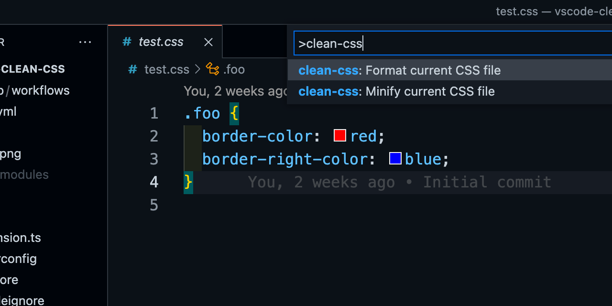

# vscode-clean-css


[](https://david-dm.org/1000ch/vscode-clean-css)
[](https://david-dm.org/1000ch/vscode-clean-css?type=dev)

Fully featured [clean-css](http://github.com/clean-css/clean-css) plugin for [Visual Studio Code](https://github.com/microsoft/vscode).

## Install

Execute `Extensions: Install Extensions` command from [Command Palette](https://code.visualstudio.com/docs/getstarted/userinterface#_command-palette) (<kbd>Cmd</kbd> <kbd>Shift</kbd> <kbd>P</kbd>) and search by **clean-css**.

Also you can install this extension locally by putting symbolic link from `~/.vscode/extensions` to `~/path/to/this/repo` like below.

```bash
$ ln -s ~/workspace/github.com/1000ch/vscode-clean-css  ~/.vscode/extensions/1000ch.clean-css-local
```

## Usage

Open the Command Palette (<kbd>Cmd</kbd> <kbd>Shift</kbd> <kbd>P</kbd>) and search following commands.

- **clean-css: Minify current CSS file**: to minify current CSS file
- **clean-css: Format current CSS file**: to format current CSS file

You can also execute these commands from context menu of [Explorer](https://code.visualstudio.com/docs/getstarted/userinterface#_explorer) or Editor.



## Config

You can configure [css-clean options](https://github.com/clean-css/clean-css#constructor-options) via [Configure Extension Settings](https://code.visualstudio.com/docs/editor/extension-gallery#_configuring-extensions).

## License

[MIT](https://1000ch.mit-license.org) © [Shogo Sensui](https://github.com/1000ch)
